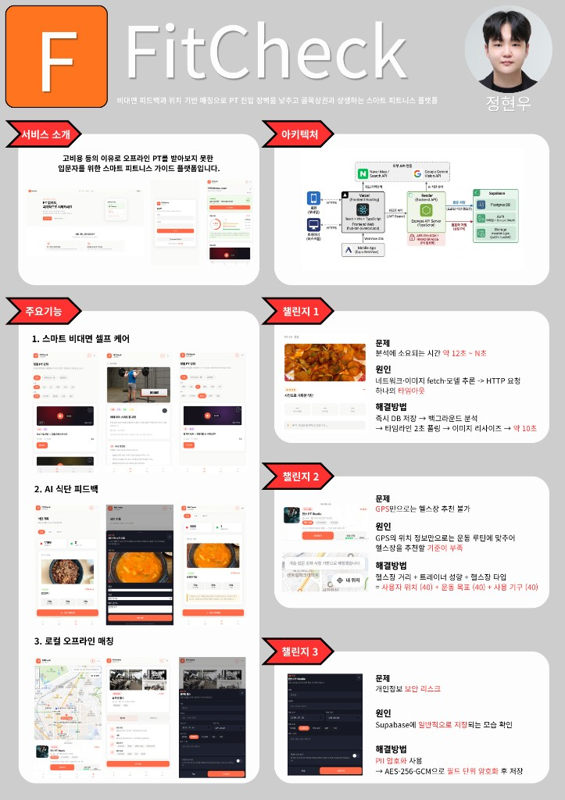
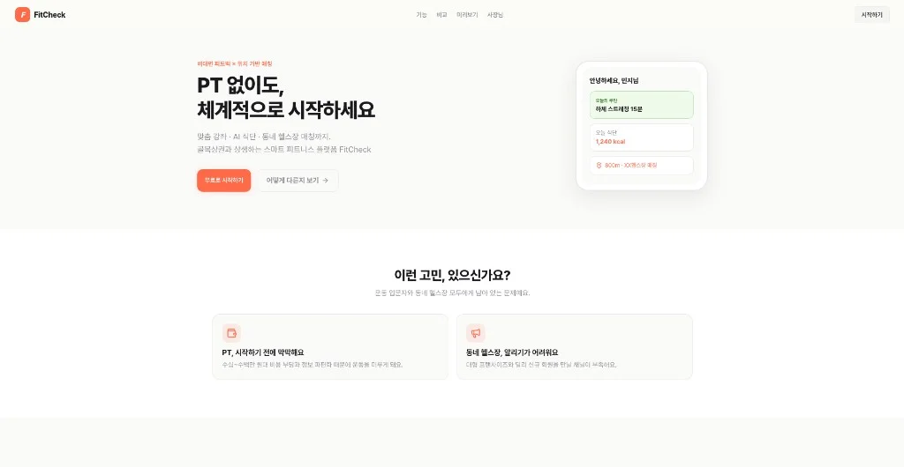
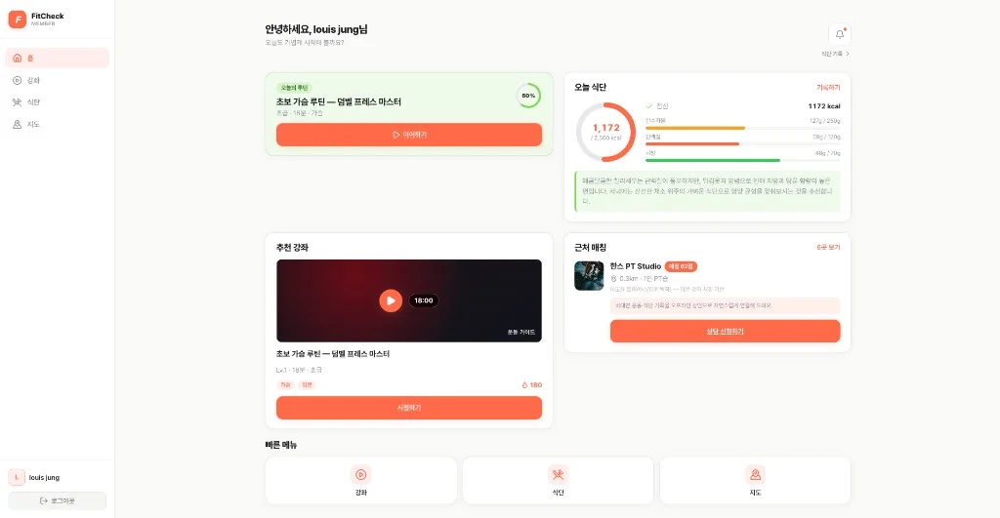
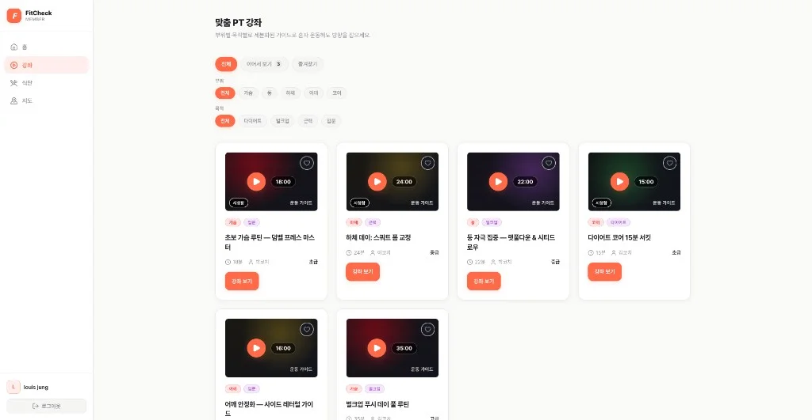
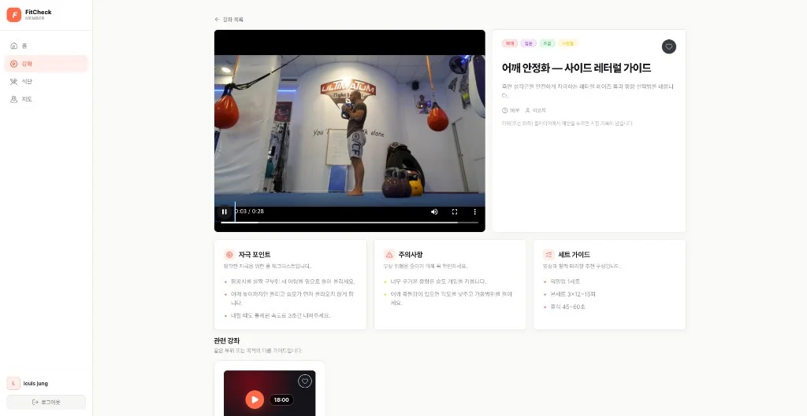
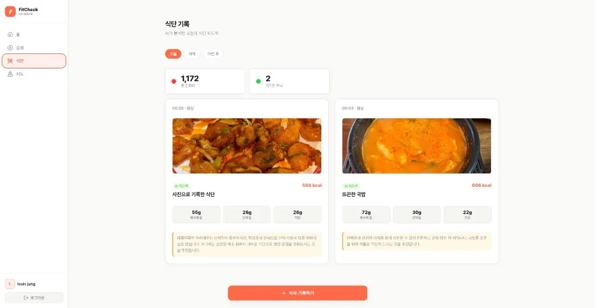
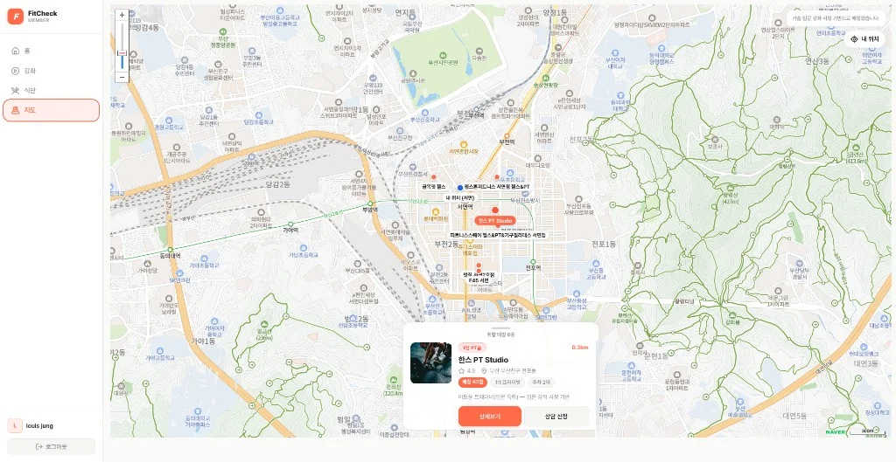
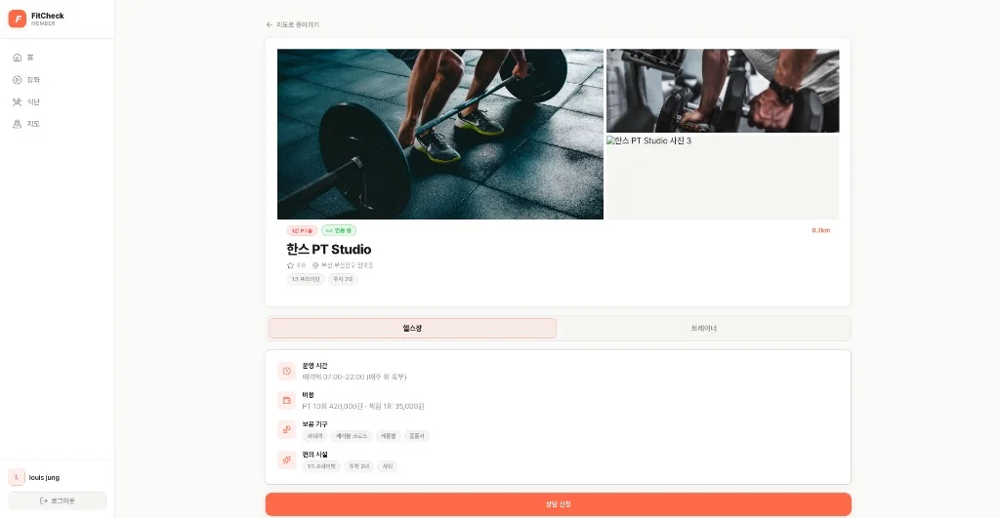
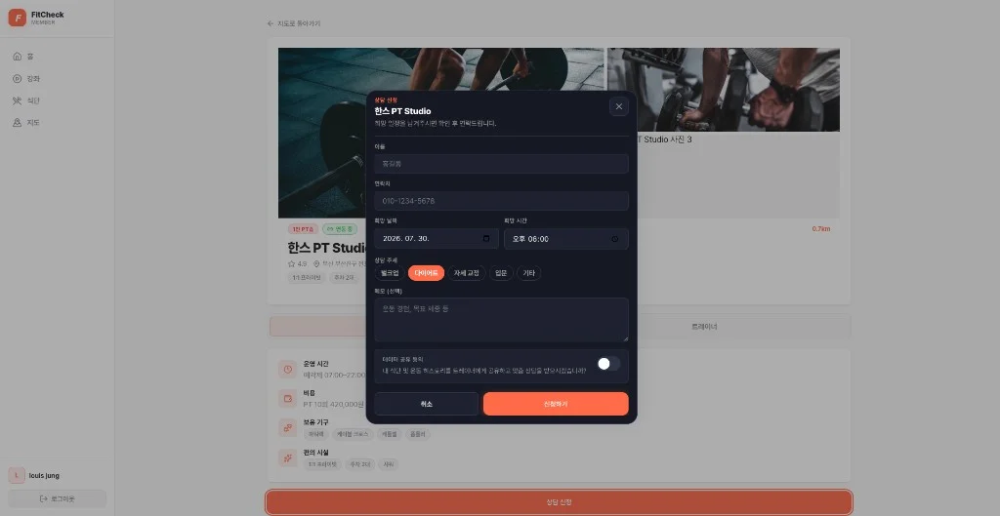
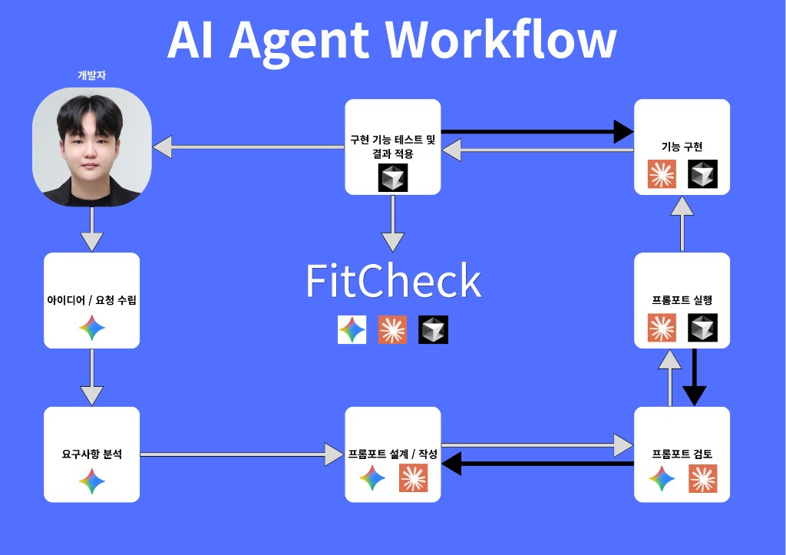

# 🏋️‍♂️ FitCheck (핏첵)

> 비대면 피드백과 위치 기반 매칭으로 PT 진입 장벽을 낮추고 골목상권과 상생하는 스마트 피트니스 플랫폼
>
> 🔗 [Notion Workspace](https://app.notion.com/p/FitCheck-396c0be45234802a8690e99fc0ab2146?source=copy_link)

> **2026-09-07** — Naver AI Agent Challenge에서 시작된 개인 프로젝트를 GitHub Organization으로 분리 및 푸시하였습니다.

`FitCheck`는 고비용 등의 이유로 오프라인 PT를 받아보지 못한 입문자를 위한 스마트 피트니스 가이드 플랫폼입니다.

사용자에게는 비용 부담 없는 비대면 운동/식단 가이드를 제공하고, 정체기나 전문 관리가 필요할 때 위치 기반 시스템으로 주변 골목 헬스장·개인 트레이너와 연결합니다. 피트니스 소상공인의 신규 회원 유치를 돕는 상생형 O2O 모델을 지향합니다.

**Live Demo:** [https://hub-tan-pi.vercel.app/](https://hub-tan-pi.vercel.app/) · **Demo Video:** [시연 영상 보기](https://photos.icloud.com/shared/album/06fPpKuI6vX9GBLu8DrCRgNHA)

백엔드 API는 별도 저장소입니다. → **[FitCheck-BE](https://github.com/FitCheck-Healthcare/FitCheck-BE)**

---

## 📋 Project Overview

서비스 소개 · 시스템 아키텍처 · 3대 핵심 기능 · 기술 챌린지를 한눈에 볼 수 있는 프로젝트 포스터입니다.

<p align="center">
  
</p>

---

## 💡 Project Background & Problem

### ❌ 페인 포인트

- **높은 PT 진입 장벽** — 수십~수백만 원대 오프라인 PT 비용
- **소상공인 마케팅 한계** — 대형 프랜차이즈 대비 홍보·유치 채널 부족

---

## 🚀 Core Value & Differentiation

### ⚡ 3대 핵심 시스템

1. **스마트 비대면 셀프 케어** — 맞춤 강좌 + AI 식단 피드백으로 혼자서도 체계적 관리
2. **로컬 오프라인 매칭** — 지도 API로 주변 소상공인 헬스장·트레이너 연결
3. **O2O Bridge** — 비대면 식단/운동 기록을 오프라인 상담으로 자연스럽게 연계

---

## ⭕ FitCheck가 만드는 변화

| 구분 | ❌ 기존 | ⭕ FitCheck |
|------|---------|-------------|
| **일반 사용자** | PT 비용·정보 파편화 | 맞춤 강좌 + 식단 피드백 + 동네 센터 추천 |
| **소상공인** | 신규 회원 유치 어려움 | 지역 진성 고객과 비용 없이 매칭 |

---

## ✨ Key Features

### 📱 회원 (Web → Mobile)

- 부위별·목적별 PT 강좌 / VOD
- AI 식단 피드백 타임라인
- 지도 기반 헬스장 추천 + **상담 신청**

### 🖥️ 트레이너 대시보드

- 회원·상담·루틴·식단 피드백 통합 관리 (확장 중)

---

## 🖼 Screenshots

비대면 셀프 케어 → AI 식단 → 로컬 헬스장 매칭 → O2O 상담까지의 사용자 여정입니다.

| | |
|:---:|:---:|
| **랜딩** — PT 없이도 체계적으로 시작 | **회원 홈** — 루틴 · 식단 · 근처 매칭 |
|  |  |
| **맞춤 PT 강좌** — 부위·목적별 VOD | **강좌 상세** — 영상 · 자극 포인트 · 세트 가이드 |
|  |  |
| **식단 기록** — Gemini Vision AI 분석·피드백 | **지도** — Naver Map · GPS 기반 헬스장 매칭 |
|  |  |
| **헬스장 상세** — 매칭 점수 · 운영 정보 | **상담 신청** — O2O 연계 · PII 암호화 폼 |
|  |  |

---

## 🛠 Tech Stack

| 영역 | 기술 |
|------|------|
| Frontend | React (Vite) / TypeScript — [Vercel](https://hub-tan-pi.vercel.app/) |
| Mobile | React Native (Expo WebView) |
| Backend | Node.js (Express) / TypeScript — [Render](https://fitcheck-server-wvj4.onrender.com) |
| Database | Supabase (Postgres · Auth · Storage) |
| AI | Google Gemini Vision (식단 분석) |
| Map | Naver Map · Search API (헬스장 매칭) |

---

## 🤖 AI Agent Workflow

아이디어 수립부터 프롬프트 설계·실행, 기능 구현·테스트까지 **Cursor Agent**와 반복 협업한 개발 흐름입니다.

<p align="center">
  
</p>

1. **아이디어 · 요구사항 분석** — 문제 정의와 MVP 범위 확정
2. **프롬프트 설계 · 검토 · 실행** — Agent에게 API·UI·테스트 초안 요청
3. **기능 구현 · 테스트 · 적용** — 실행·검증 후 FitCheck에 반영

---

## 💻 Getting Started

웹·모바일은 이 저장소에서, API 서버는 **[FitCheck-BE](https://github.com/FitCheck-Healthcare/FitCheck-BE)**에서 실행합니다.

| 패키지 | 설명 | 문서 |
|--------|------|------|
| `frontend-web` | 웹 UI | [frontend-web/README.md](./frontend-web/README.md) |
| `mobile-app` | Expo WebView | [mobile-app/README.md](./mobile-app/README.md) |
| [FitCheck-BE](https://github.com/FitCheck-Healthcare/FitCheck-BE) | API · DB · PII 암호화 | [FitCheck-BE README](https://github.com/FitCheck-Healthcare/FitCheck-BE#readme) |

### Frontend Web

```bash
cd frontend-web
npm install
cp .env.example .env.local
npm run dev
```

→ http://localhost:5173  
로컬 API 연동 시 [FitCheck-BE](https://github.com/FitCheck-Healthcare/FitCheck-BE)를 `localhost:5001`에서 함께 실행합니다.

### Mobile App (선택)

```bash
cd mobile-app
npm install
npm start
```

`EXPO_PUBLIC_WEB_APP_URL`을 frontend-web 주소로 맞춥니다 (실기기는 LAN IP, 배포본은 Vercel URL).

### Prerequisites

- Node.js v18+
- Expo Go 또는 시뮬레이터 (모바일 확인 시)

---

## 🔐 Security (요약)

상담 신청 시 수집하는 이름·연락처·메모 등 PII는 백엔드에서 **AES-256-GCM**으로 암호화해 저장합니다. 전화번호 조회용 **HMAC-SHA256**(`phone_hmac`)을 별도 사용합니다.

→ **[암호화 상세 문서](https://github.com/FitCheck-Healthcare/FitCheck-BE#상담-신청-개인정보-암호화)**

---

## 📁 Repository Layout

```
FitCheck-FE/
├── README.md                 ← 이 파일 (프로젝트 소개)
├── image/                    ← 포스터 · 스크린샷 · AI 워크플로우
├── frontend-web/
│   └── README.md             ← 웹 개발 가이드
└── mobile-app/
    └── README.md             ← Expo WebView
```

관련 저장소: [FitCheck-BE](https://github.com/FitCheck-Healthcare/FitCheck-BE)
